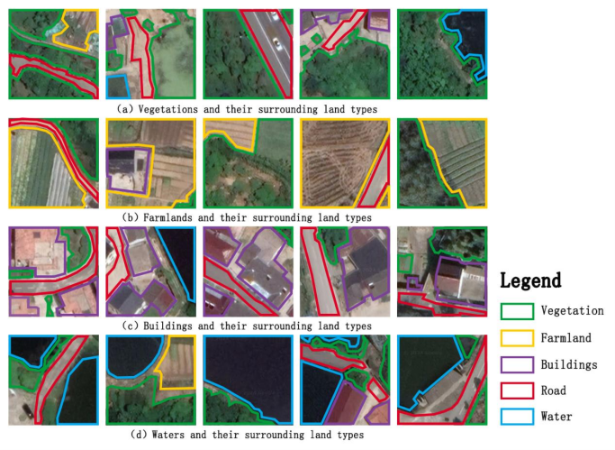
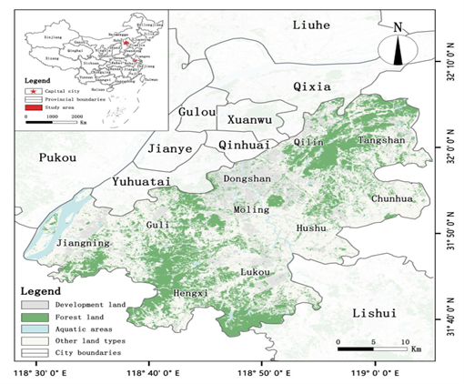
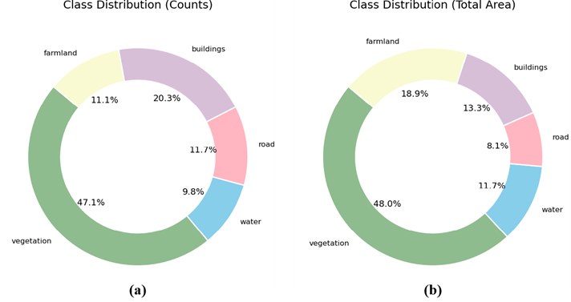
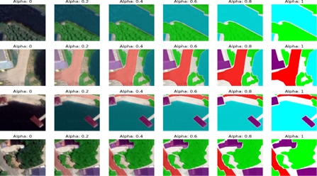

# RuralUse - A dataset for semantic segmentation in rural land use analysis

**RuralUse** is a dataset designed for semantic segmentation in rural land use analysis, created using open-source data from GEE (Google Earth Engine).

**RuralUse** was produced and made publicly available by Jiangsu Open University. It consists of a total of 2,042 RGB images, each with a size of 224×224 pixels.

The dataset includes annotations in JSON format provided through Labelme, as well as mask annotation files in Mask format. It can be accessed via the following link: [RuralUse Dataset on Kaggle](https://www.kaggle.com/datasets/vvghigh/ruraluse)

  

## Study Area

Jiangning, Nanjing City, Jiangsu Province, China.

  

## Instructions

Before using the scripts, it is necessary to verify the file paths. The Code can be downloaded in the link: https://github/luotiger123/Land_Unet

1. **Category_Cal.py**: To check each category's distributions and counts (Pixels).  
   
   

     
   

2. **Visualization.py**: To visualize the categories in different alphas.

  

## Attention

- The dataset is **not commercially available**. If you use it, please cite the following link: `{pending paper acceptance}`  
- For technical questions about the data, contact: <yanzhao@njfu.edu.cn>